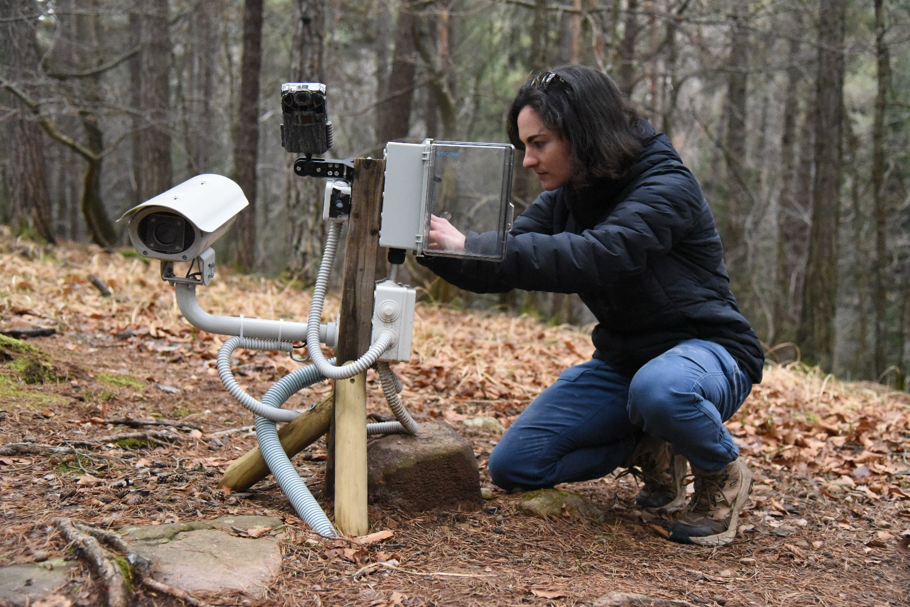
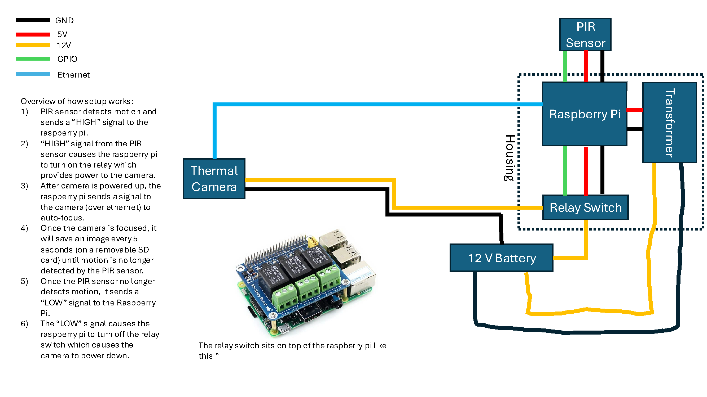

# Deer_Cam
DeerCam is a field-deployable system for automated infrared thermography of wildlife, designed to function like a camera trap. This repository contains all code and documentation needed to build and operate DeerCam—a Raspberry Pi–based platform that captures thermal images using a FLIR A325sc camera via the FLIR Spinnaker SDK. The README includes detailed instructions for assembling the system, configuring hardware, and processing the resulting thermal imagery.

For questions regarding the DeerCam system, please contact the developer, Rhemi Toth, at [rhemitoth@g.harvard.edu](mailto:rhemitoth@g.harvard.edu).


## Description
DeerCam is designed to function similarly to a camera trap. When an animal passes in front of the system, a passive infrared (PIR) motion sensor connected to the Raspberry Pi triggers a relay that supplies power to the thermal camera. Once powered on and connected to the Raspberry Pi, the camera begins capturing images at user-defined intervals for a user-specified duration. After this period, the system checks for continued motion. If no motion is detected, the camera is powered off. To operate the DeerCam System autonomously in the field, the researcher must provide a 12V power supply and a waterproof housing for the Raspberry Pi, PIR sensor, and thermal camera.



 

## Getting Started

### Hardware

- Power:
    - **12V power supply.** In the field, we use a car battery to power the system, but any reliable 12V power source will work.
    - **DC to DC Converter.** To power the Raspberry Pi from the 12V supply, we use a DC-to-DC converter by Klunoxj, which accepts 12V or 24V input and outputs 5V at 5A via a USB-C connector.
    - **2-pin screw terminal connector and wiring.** The FLIR A325sc camera is powered by connecting wires fitted to a compatible 2-pin screw terminal connector, which then connects directly to the 12 V power supply.

- Camera Parts:
    - **FLIR A3xx Camera.** The DeerCam system is designed for use with the FLIR A325sc, but other FLIR A3xx models may also be compatible. However, we have not tested compatibility with other models.
    - **Ethernet cable.** FLIR A3xx series cameras transmit data via Gigabit Ethernet (GigE). In the DeerCam system, the Raspberry Pi also uses Telnet commands over the Ethernet connection to control the camera's autofocus.

- Raspberry Pi Parts:
    - **Raspberry Pi 5.** Currently, DeerCam must be run on a Raspberry Pi 5 and is not compatible with earlier models. Running DeerCam on an older Pi would require modifying some of the code (e.g., how the GPIO pins are configured).
    - **USB SD card reader.** After retrieving images from the camera, DeerCam saves them to an SD card connected to the Raspberry Pi via a USB SD card reader.
    - **PIR sensor and wiring.** To detect motion, DeerCam uses input from a PIR sensor connected to one of the GPIO pins.
    - **Relay switch.** A relay switch controls power to the camera, ensuring the camera is only powered when needed. This design choice helps conserve battery life by preventing the camera from drawing power continuously when no animals are present.
    - **DS3231 Real-Time Clock.** The Raspberry Pi normally retrieves time from the internet. For field deployments without connectivity, an RTC module is required so the device can maintain accurate time.
    - **e-Paper display.** System status messages (e.g., "Connecting to camera", "Focusing camera", "Collecting images", "WARNING: No SD card") are shown on a 2.7-inch e-Paper Display HAT from Waveshare. Because it doesn't use backlighting, the e-Paper display is ideal for providing status updates without disturbing animals.
    - **Prototyping HAT.** The PIR sensor, RTC module, and e-Paper display are connected via a prototyping HAT. DeerCam is designed to work with the Perma-Proto HAT from Adafruit.
    - **Stacking headers and standoffs.** To physically attach the relay, prototyping HAT, and e-Paper display to the Raspberry Pi, stacking headers and standoffs are used.

- Materials for Field Deployment:
    - **Camera housing and Germanium window.** To protect the thermal camera from environmental exposure, we modified a BOSCH UHO-POE-10 outdoor housing by replacing the front glass with a Germanium window. Since thermal radiation cannot pass through glass, it’s essential that the housing window is made from a material like Germanium that transmits infrared radiation.
    - **Raspberry Pi housing.** The Raspberry Pi is enclosed in an IP67-rated waterproof electrical junction box to shield it from moisture and dust in the field.
    - **PIR sensor housing.** The PIR sensor and its wiring are enclosed in a waterproof plastic box. We modified the box by cutting a hole to match the diameter of the PIR sensor's globe and sealed it with waterproof sealant to ensure durability in outdoor conditions.
    - **Weather Station.** This is a separate system that should be deployed alongside DeerCam. To estimate animal surface temperature from the raw FLIR data, it is essential to record environmental conditions—specifically air temperature, humidity, solar radiation, and longwave radiation—at the time each image is captured.


### Assembly

The DeerCam System is composed of four primary "layers," listed below from bottom to top:

#### **Layer 1: Raspberry Pi**


#### **Layer 2: Relay**

In the DeerCam System, the positive wire connecting the battery to the camera is routed through a relay switch to allow the Raspberry Pi to control camera power.

  


#### **Layer 3: Prototyping HAT**

The RTC module and PIR sensor wiring are soldered directly onto the prototyping HAT. The e-paper display (Layer 4) connects to the HAT by attaching directly to its GPIO pins.

  


#### **Layer 4: e-Paper Display**

  


To connect DeerCam to power and connect the thermal camera to the RaspberryPi, please refer to the following diagram:




### Automatically Running DeerCam on Startup

To ensure the DeerCam system starts automatically when the Raspberry Pi powers on, we use a `systemd` service called `run_on_startup.service`.

### The Startup Script

This service runs the `run_on_startup.sh` script, which:

- Initializes the Conda environment (`flir.env`)
- Launches the FLIR camera controller script
- Logs output to a file for debugging

Here’s what the `run_on_startup.sh` script looks like:

```bash
#!/bin/bash

# Load conda
source /home/moorcroftlab/miniforge3/etc/profile.d/conda.sh

# Activate the environment
conda activate /home/moorcroftlab/miniforge3/envs/flir.env

# Run the Python script and log output
python /home/moorcroftlab/Documents/FLIR/FLIR_A325sc_Controller/FLIR_A325sc_Controller_Complete.py > /home/moorcroftlab/Documents/FLIR/FLIR_A325sc_Controller/run_on_startup.log 2>&1
```

Descriptions for all of the modules required to run DeerCam can be found in the modules section of `FLIR_A325sc_Controller_Complete.py`. All of these modules should be imported into your conda environment before attempting the run the DeerCam System.

#### Setting Up the Startup Service

If you're setting this up on a new device, follow these steps:

1. Create the service file

Save the following content to `/etc/systemd/system/run_on_startup.service`:

```ini
[[Unit]
Description=My Script Service
After=graphical.target

[Service]
Type=simple
ExecStart=/usr/bin/lxterminal -e /home/moorcroftlab/Documents/FLIR/FLIR_A325sc_$
Restart=always
RestartSec=3

[Install]
WantedBy=default.target
```

2. Make the script executable
```bash
chmod +x /home/USERNAME/path/to/run_on_startup.sh
```

3. Enable and start the service
```bash
sudo systemctl enable run_on_startup.service
sudo systemctl start run_on_startup.service
```

In addition to implementing a `systemd` service to run DeerCam at startup, we also programmed a cron job to reboot the Raspberry Pi every day at midnight to ensure system stability.


## Processing the Data

Extracting animal surface temperature from raw FLIR data involves a three-step workflow. First, as with any camera trap dataset, images containing animals of interest must be identified. Once relevant images are selected, animal pixels must be separated from the background. Finally, the raw FLIR data—recorded as sensor energy—must be converted into surface temperature.

### **Step 1:** Filtering the Images

DeerCam captures images whenever the PIR sensor is triggered, without distinguishing between animal species. To isolate images containing our target species (roe deer), we used a machine learning tool called [DeepFaune](https://www.deepfaune.cnrs.fr/en/), which automatically classifies images based on the animals they contain.

### **Step 2:** Segmenting the Images

After filtering, it is useful to extract the pixels corresponding to the animal from the background so that surface temperature can be accurately estimated (e.g., by computing the mean temperature of those pixels after conversion). 

### **Step 3:** Calculating Surface Temperature

FLIR cameras do not directly measure surface temperature. Instead, they record total incoming thermal radiation in units of analog-to-digital (A/D) counts. Following the methodology described in Appendix A of Johnston et al. (2021), one can convert raw FLIR data into surface temperature values.

The Jupyter Notebook `Thermal_Image_Processing.ipynb` demonstrates how to perform Steps 2 and 3, that is extracting animal pixels from the background using a watershed segmentation technique and converting the raw FLIR data to units of surface temperature.

  


## References

Chamaille-Jammes, S., Miele, V., Dussert, G., Rossignol, C., Spataro, B., & DeepFaune Team. (2022). *DeepFaune software* [Computer software]. https://plmlab.math.cnrs.fr/deepfaune/software/

Johnston, M. R., Andreu, A., Verfaillie, J., Baldocchi, D., González-Dugo, M. P., & Moorcroft, P. R. (2021). Measuring surface temperatures in a woodland savanna: Opportunities and challenges of thermal imaging in an open-canopy ecosystem. *Agricultural and Forest Meteorology, 310*, 108484. https://doi.org/10.1016/j.agrformet.2021.108484


